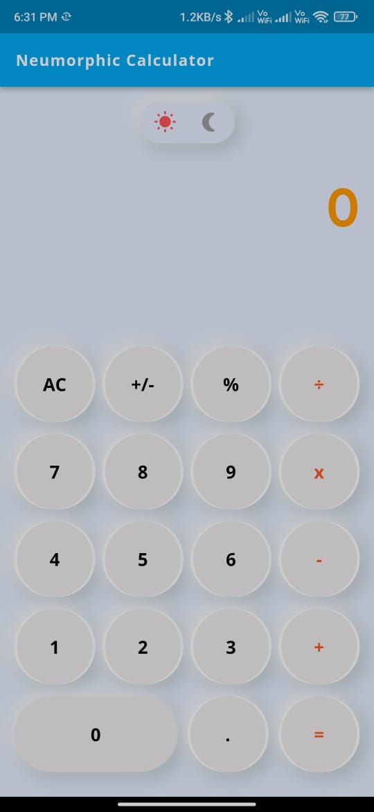
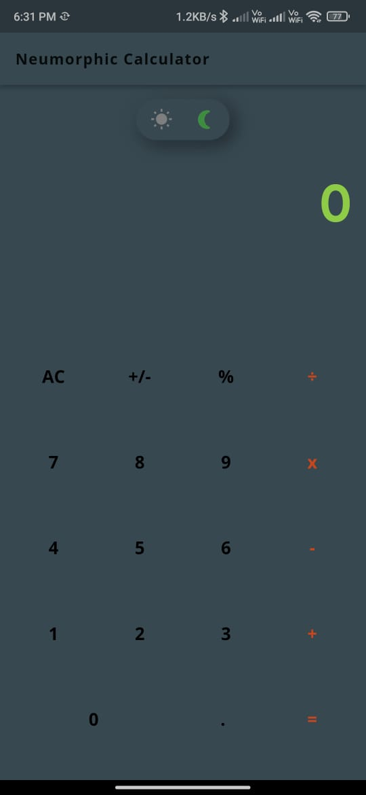

# calculator_with_neumorphic_design

A new Flutter project.

## Getting Started

It is a normal Calculator App built using Flutter, the buttons were designed using neumorphic design... also i have added a new feature to it i.e; the color mode which is added below the app bar.

It is the first project which is build my Rudra Narayan panda while learning Flutter.

#Sneak peaks
<h3 align = "center" >Light Mode Neumorphic Calculator</h3>

 
  
  
<h3 align = "center">Dark Mode Neumorphic Calculator</h3>

 

A few resources to get you started if this is your first Flutter project:

- [Lab: Write your first Flutter app](https://docs.flutter.dev/get-started/codelab)
- [Cookbook: Useful Flutter samples](https://docs.flutter.dev/cookbook)

For help getting started with Flutter development, view the
[online documentation](https://docs.flutter.dev/), which offers tutorials,
samples, guidance on mobile development, and a full API reference.

